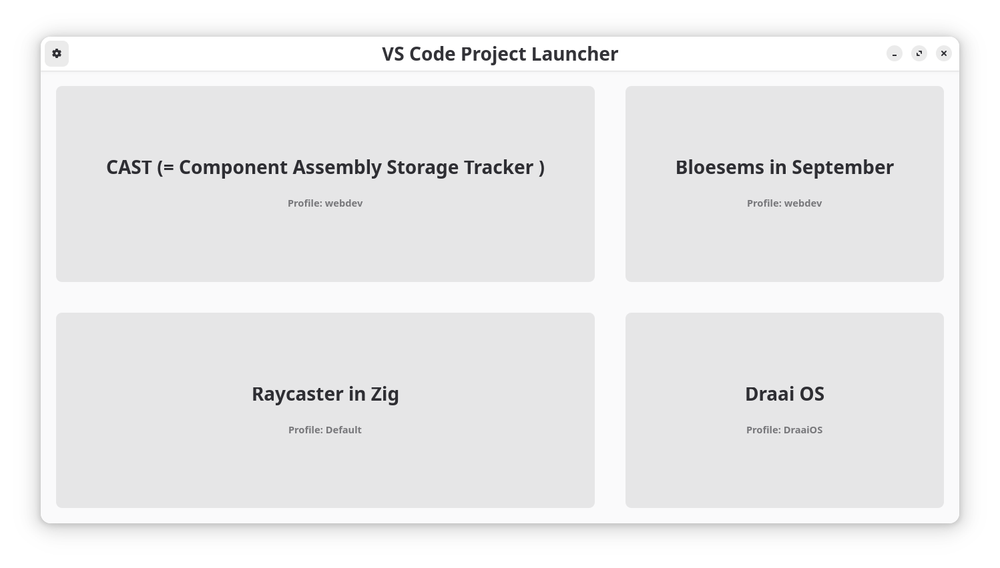
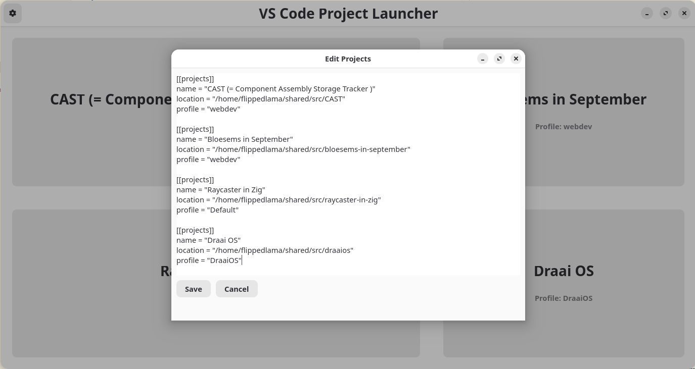

# VS Code Projects Launcher

A minimal GTK4 Python application that lets you manage and launch your VS Code projects with their own profiles.

<p align="center">
  
  
</p>

## 🧩 Features

- Read projects from a simple `projects.toml` file
- Launch VS Code with `--profile` and project path in one click
- Clean GTK4 UI with a native look
- Edit the TOML file directly via the built-in settings screen
- Responsive layout with dark/light theme support
- Optional `.desktop` integration and launcher icon


## 📁 TOML Configuration

Create a `projects.toml` file in the working directory like this:

```toml
[[projects]]
name = "CAST"
location = "/home/liv/projects/cast"
profile = "CAST"

[[projects]]
name = "Side Project"
location = "/home/liv/projects/side"
profile = "Default"
```


## 📦 AUR Packaging

To install from source:

```bash
makepkg -si
```


## 📄 License

GPL-3 License. See [LICENSE](LICENSE).


## 🤝 Contributing

PRs welcome! Bug reports and ideas too.
